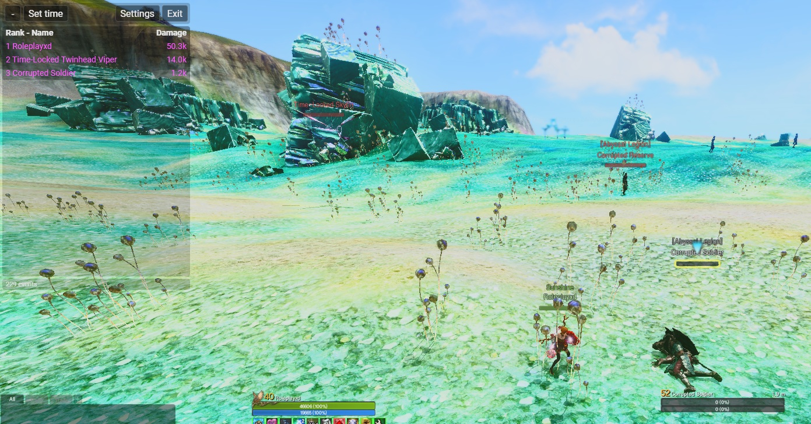
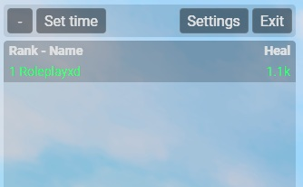
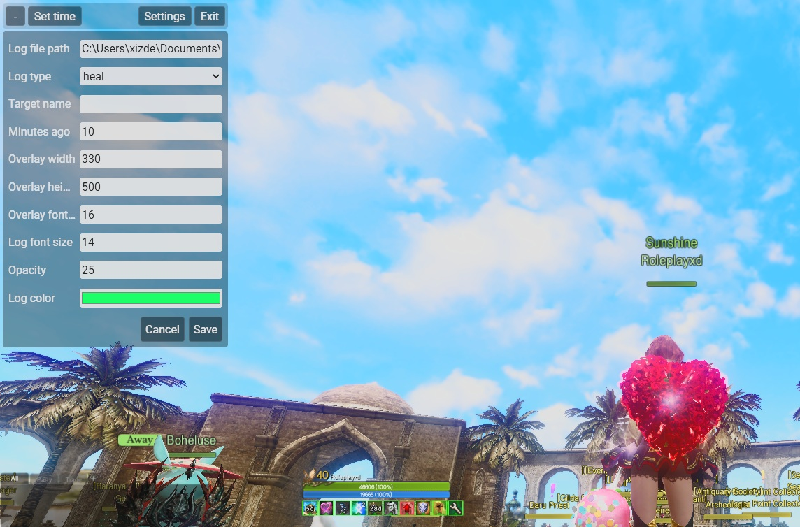

# ArcheRage Damage/Heal Meter Overlay

Lightweight Windows overlay for ArcheRage combat logs, rewritten in Rust + Tauri v2.

The app reads `Combat.log`, aggregates damage or healing by character, and displays a small always-on-top overlay while you play.

## Screenshots

### Damage



### Heal



### Settings



## Features

- Near real-time damage and healing meter from `Combat.log`
- Low-overhead Rust backend with incremental log reading
- Transparent always-on-top overlay
- Damage/heal modes
- Target filter
- Configurable size, opacity, font size, log color, and time window
- "Set time" button to reset the meter from the current moment
- Log parser support for EN, KR, RU, and color-coded ArcheAge log variants

## Download For Players

Use the packaged release ZIP or installer generated from this repository.

Portable ZIP contents:

```text
archerage_meter_overlay.exe
config.json
README.txt
```

Run `archerage_meter_overlay.exe`. On Windows, the app tries to use this default log path automatically:

```text
C:\Users\<your-user>\Documents\ArcheRage\Combat.log
```

If your log is somewhere else, open `Settings` in the overlay and change `Log file path`.

## In-Game Setup

Enable combat logging in the ArcheRage client. The combat log is normally written to:

```text
Documents\ArcheRage\Combat.log
```

If the meter shows no rows, check that:

- ArcheRage is writing to `Combat.log`
- `Log file path` points to the correct file
- `Log type` is set to `damage` or `heal` as needed
- `Minutes ago` covers the time when combat happened
- `Target name` is empty, or exactly matches the target you want to filter

## Configuration

The app reads `config.json` from the same folder as the executable when packaged.

Example:

```json
{
  "overlayPosition": [30, 30],
  "overlayWidth": 330,
  "overlayHeight": 270,
  "overlayFontSize": 14,
  "overlayLogsFontSize": 12,
  "overlayOpacity": "7",
  "overlayLogColor": "#ff55ff",
  "logFilePath": "",
  "logMinutesAgo": 10,
  "targetName": "",
  "logType": "damage"
}
```

Leaving `logFilePath` empty makes the app use the default ArcheRage path for the current Windows user.

## Development

Requirements:

- Windows
- Rust stable
- Node.js + npm
- Microsoft WebView2 Runtime
- Visual Studio Build Tools with MSVC

Install dependencies:

```bash
npm install
```

Run in development mode:

```bash
npm run tauri:dev
```

Run checks:

```bash
npm run build
cargo test --manifest-path src-tauri/Cargo.toml
```

Build release binaries:

```bash
npm run tauri:build
```

Generated binaries:

```text
src-tauri/target/release/archerage_meter_overlay.exe
src-tauri/target/release/bundle/nsis/ArcheRage Meter_0.1.0_x64-setup.exe
src-tauri/target/release/bundle/msi/ArcheRage Meter_0.1.0_x64_en-US.msi
```

## Project Layout

```text
src/                 Tauri frontend overlay UI
src-tauri/src/       Rust backend, config, parser, meter state
config.json          Default runtime configuration
icon.ico             Windows app icon
```

## Packaging

After `npm run tauri:build`, create a player ZIP with:

```text
archerage_meter_overlay.exe
config.json
README.txt
```

The generated ZIP in `release/` is ignored by git and can be uploaded to GitHub Releases, Discord, or the ArcheRage forum.

## License

MIT. See [LICENSE](LICENSE).
